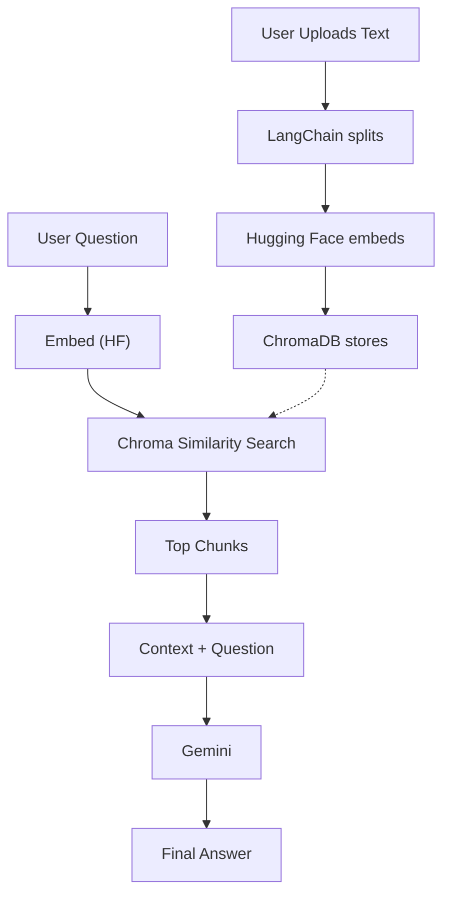

# AI SEC Filing Analyzer

A full-stack web application that demonstrates Generative AI capabilities for analyzing SEC filings, built to showcase skills for Junior Generative AI Developer positions.

## 🚀 **Try It Now**

**Need SEC filing URLs?** Visit the official SEC EDGAR database:
👉 **https://www.sec.gov/search-filings**

**Quick Start:**
1. Search for any public company (e.g., "Apple", "Microsoft", "Tesla")
2. Find a recent 10-K, 10-Q, or 8-K filing
3. Copy the filing URL 
4. Paste it into this application with your question!

**💡 Pro Tips:**
- **10-K**: Annual reports (great for comprehensive analysis)
- **10-Q**: Quarterly reports (perfect for recent financial data)
- **8-K**: Current reports (ideal for specific events/announcements)

## 🎯 Purpose

This application demonstrates proficiency in key technologies and concepts relevant to Generative AI development:

- **LLM Integration**: Using Large Language Models for document analysis and question answering
- **Vector Embeddings**: Converting SEC filings into searchable vector representations
- **Prompt Engineering**: Crafting effective prompts for financial document analysis
- **REST API Development**: Building scalable backend services with FastAPI
- **Full-Stack Development**: JavaScript frontend with Python backend integration
- **SOLID Principles**: Clean, maintainable, and extensible code architecture

## 🚀 Features

- **SEC Filing Analysis**: Input SEC filing URLs for AI-powered analysis
- **Natural Language Queries**: Ask questions about filings in plain English
- **Intelligent Responses**: Get detailed, contextual answers about financial data
- **Vector Search**: Efficient document retrieval using embedding-based search
- **Modern UI**: Clean, responsive frontend built with JavaScript
- **FastAPI Backend**: High-performance Python backend with automatic API documentation

## 🛠 Tech Stack

### Backend
- **Python 3.9+**: Core backend language
- **FastAPI**: Modern, fast web framework for building APIs
- **LangChain**: Framework for developing LLM-powered applications
- **Google Gemini**: Large Language Model for text analysis (free tier)
- **Hugging Face Transformers**: Open-source embeddings and models
- **ChromaDB**: Vector database for embeddings storage (no SQL database needed)
- **Requests**: HTTP library for SEC filing retrieval
- **Pydantic**: Data validation and serialization

### Frontend
- **Vanilla JavaScript**: Pure JS for frontend interactivity
- **HTML5/CSS3**: Modern web standards
- **Bootstrap**: Responsive UI components
- **Fetch API**: For backend communication

### AI/ML Components
- **Google Gemini API**: Advanced text analysis and question answering
- **Hugging Face Embeddings**: Free, high-quality text-to-vector conversion
- **Vector Similarity Search**: Document retrieval and ranking
- **Prompt Engineering**: Optimized prompts for financial analysis
- **Document Processing**: SEC filing parsing and chunking

## 📋 Example Use Cases

1. **Earnings Analysis**: 
   - Input: SEC 8-K filing URL + "What were the Q3 2024 earnings?"
   - Output: "Q3 2024 earnings were $1,231,231 with a 15% increase from previous quarter..."

2. **Filing Summary**:
   - Input: SEC 10-K filing URL + "What is this filing about?"
   - Output: "This is a 10-K annual report covering: • Financial performance • Risk factors • Management discussion..."

3. **Financial Metrics**:
   - Input: Any SEC filing + "What are the key financial metrics?"
   - Output: Detailed breakdown of revenue, profit margins, cash flow, etc.

## 🏗 Architecture

### RAG Pipeline Workflow



### Project Structure

The application follows SOLID principles and clean architecture patterns:

```
├── backend/
│   ├── app/
│   │   ├── api/          # FastAPI route handlers
│   │   ├── core/         # Configuration and settings
│   │   ├── models/       # Pydantic data models
│   │   ├── services/     # Business logic layer
│   │   └── utils/        # Utility functions
│   ├── chroma_db/        # Vector database storage (no SQL needed)
│   ├── main.py           # FastAPI application entry point
│   └── requirements.txt  # Python dependencies
├── frontend/
│   ├── assets/           # Static assets (CSS, JS)
│   ├── components/       # Reusable UI components
│   └── index.html        # Main application page
└── docs/                 # Additional documentation
```

### Data Architecture

- **No SQL Database**: ChromaDB handles all data storage needs
- **Vector-First**: Document chunks stored as 384-dimensional embeddings
- **Metadata Storage**: JSON-like metadata stored alongside vectors
- **In-Memory Processing**: Document processing happens entirely in memory
- **Persistent Vectors**: ChromaDB provides local persistence without complex database setup

### How the RAG Pipeline Works

1. **Document Ingestion**: User provides SEC filing URL
2. **Content Extraction**: Multi-format processor fetches and cleans document
3. **Text Chunking**: LangChain splits document into 1000-character chunks with 200-char overlap
4. **Embedding Generation**: Hugging Face Sentence Transformers convert chunks to 384-dim vectors
5. **Vector Storage**: ChromaDB stores embeddings with metadata (no SQL database needed)
6. **Query Processing**: User question gets embedded using same Hugging Face model
7. **Similarity Search**: ChromaDB finds top 8 most relevant document chunks
8. **Context Assembly**: Retrieved chunks become context for the AI prompt
9. **AI Analysis**: Google Gemini analyzes context and generates accurate answer
10. **Response Delivery**: User receives answer with confidence score and metadata

## 🔧 Installation & Setup

### Prerequisites
- Python 3.9+
- Node.js (for frontend development)
- Google AI Studio API key (free at https://aistudio.google.com/)

### Backend Setup
```bash
# Create virtual environment
python -m venv venv
source venv/bin/activate  # On Windows: venv\Scripts\activate

# Install dependencies
cd backend
pip install -r requirements.txt

# Set environment variables
export GOOGLE_API_KEY="your-google-ai-key-here"  # On Windows: set GOOGLE_API_KEY=your-key

# Run the application
uvicorn main:app --reload --host 0.0.0.0 --port 8000
```

**🚀 First Run:** The application will automatically:
- Create the `chroma_db/` directory and vector database files
- Download the Hugging Face embedding model (~90MB)
- Initialize all AI components

**⚡ Subsequent Runs:** Everything loads faster as models and database are cached locally.

### Frontend Setup
```bash
cd frontend
# Serve with any HTTP server, e.g.:
python -m http.server 3000
# or
npx serve .
```

## 📖 **How to Use the Application**

### Step 1: Find a SEC Filing
1. **Go to SEC EDGAR**: https://www.sec.gov/search-filings
2. **Search** for any public company (Apple, Tesla, Microsoft, etc.)
3. **Filter** by filing type:
   - **10-K**: Annual comprehensive reports
   - **10-Q**: Quarterly financial reports  
   - **8-K**: Current event reports
4. **Click** on any recent filing
5. **Copy** the URL from your browser

### Step 2: Analyze with AI
1. **Open** the application at `http://localhost:3000`
2. **Paste** the SEC filing URL into the input field
3. **Ask** your question in plain English:
   - *"What were the total revenues for Q3 2024?"*
   - *"What are the main risk factors?"*
   - *"How much cash does the company have?"*
   - *"What is the company's outlook for next year?"*
4. **Submit** and get intelligent analysis in seconds!

### Step 3: Explore the Results
- **AI Analysis**: Get detailed, sourced answers
- **Confidence Score**: See how confident the AI is
- **Source Attribution**: Know exactly where information came from
- **Filing Metadata**: Company name, filing type, and dates

### 🎯 **Best Questions to Ask**
- **Financial Metrics**: *"What were the revenues, profits, and cash flow?"*
- **Risk Analysis**: *"What risks does management identify?"*  
- **Strategy**: *"What is the company's strategy for growth?"*
- **Recent Changes**: *"What major events happened this quarter?"*
- **Comparisons**: *"How did this quarter compare to last year?"*

### 💡 **Example Workflow**

Here is a complete walkthrough from finding a filing on SEC.gov to getting an AI-powered analysis.

**Step 1: Search for a company on the SEC EDGAR database.**
*Navigate to https://www.sec.gov/search-filings and search for a public company.*


**Step 2: Find a recent 10-K or 10-Q filing.**
*From the search results, locate the filing documents for the company.*


**Step 3: Open the filing document.**
*Click on the filing to open it. Look for the HTML document link.*


**Step 4: Copy the URL of the filing.**
*Once the filing is open in your browser, copy the full URL from the address bar.*


**Step 5: Paste the URL and ask your question.**
*Paste the URL into the application, type your question in plain English, and click "Analyze".*


**Step 6: Get an instant AI-powered response.**
*The system will process the document and provide a detailed, contextual answer to your question.*


## 🎯 Why Vector-First Architecture?

This application demonstrates modern AI-first architecture principles:

- **No SQL Complexity**: Eliminates need for database schemas, migrations, and ORM layers
- **AI-Native Storage**: ChromaDB is purpose-built for machine learning workloads
- **Faster Development**: No database design phase - focus purely on AI functionality
- **Better Performance**: Vector similarity search is faster than SQL joins for this use case
- **Simpler Deployment**: One less system to configure and maintain
- **Modern Best Practices**: Follows current trends in AI/ML application architecture

## 📚 Skills Demonstrated

This project showcases the following skills relevant to Generative AI development:

### Core AI/ML Skills
- [x] **LLM Integration**: Google Gemini integration for text analysis
- [x] **Embeddings**: Hugging Face embeddings for semantic search
- [x] **Prompt Engineering**: Optimized prompts for financial analysis
- [x] **Vector Stores**: Chroma vector database implementation
- [x] **Document Processing**: SEC filing parsing and chunking
- [x] **Open Source AI**: Hugging Face transformers ecosystem

### Software Development
- [x] **Python Proficiency**: Clean, well-structured Python code
- [x] **JavaScript Skills**: Modern frontend development
- [x] **REST APIs**: FastAPI backend with proper HTTP methods
- [x] **OOP Principles**: Object-oriented design patterns
- [x] **SOLID Principles**: Single responsibility, dependency injection, etc.
- [x] **Version Control**: Git workflow and best practices

### Gen-AI Frameworks
- [x] **LangChain**: Document loaders, text splitters, vector stores
- [x] **Google Gemini API**: Advanced language model capabilities
- [x] **Hugging Face**: Open-source transformer models and embeddings
- [x] **ChromaDB**: Vector database for similarity search and retrieval

### Data & APIs
- [x] **HTTP APIs**: RESTful service design
- [x] **Data Validation**: Pydantic models for type safety
- [x] **Error Handling**: Robust error handling and logging
- [x] **Documentation**: Automatic API documentation with FastAPI
- [x] **Vector-First Architecture**: No SQL database complexity, pure vector storage

## 🚀 Future Enhancements

### Planned Features
- [ ] **Docker Containerization**: Full containerization with Docker Compose
- [ ] **Azure Deployment**: Cloud deployment on Azure Container Instances
- [ ] **Azure Cognitive Services**: Integration with Azure OpenAI Service
- [ ] **CI/CD Pipeline**: GitHub Actions for automated deployment
- [ ] **Enhanced Vector Storage**: Distributed ChromaDB or Pinecone for scale
- [ ] **Authentication**: User management and API key handling
- [ ] **Caching**: Redis for improved performance
- [ ] **Monitoring**: Application insights and logging

### Advanced AI Features
- [ ] **Multi-Model Support**: Integration with various LLM providers
- [ ] **RAG Pipeline**: Advanced Retrieval-Augmented Generation
- [ ] **Fine-tuning**: Custom models for financial analysis
- [ ] **Streaming Responses**: Real-time response streaming
- [ ] **Multi-document Analysis**: Compare multiple filings

## 📄 API Documentation

Once the backend is running, visit `http://localhost:8000/docs` for interactive API documentation powered by FastAPI's automatic OpenAPI generation.

### 🎯 **API Design**

This project implements **modern RESTful API design principles**:

#### **Core API Endpoints**
```
POST   /api/v1/analyses           # Create new SEC filing analysis
GET    /api/v1/analyses           # List all analyses (with pagination)
GET    /api/v1/analyses/{id}      # Get specific analysis by ID
GET    /api/v1/system/status      # Comprehensive system health check
GET    /api/v1/filings/types      # List supported SEC filing types
GET    /api/v1/examples/queries   # Example questions and usage patterns
```

#### **REST Design Principles Demonstrated**
- **Resource-Oriented**: URLs represent resources, not actions
- **HTTP Status Codes**: 201 for creation, 404 for not found, etc.
- **Proper HTTP Methods**: POST for creation, GET for retrieval, DELETE for removal
- **Consistent Response Format**: All endpoints follow the same error/success patterns
- **API Documentation**: Auto-generated OpenAPI/Swagger documentation

### 🗂️ **Data Storage Architecture**

**ChromaDB (Vector Database):**
- ✅ Document chunks and embeddings are persisted
- ✅ Automatically created when first used (not in Git)
- ✅ Each user builds their own clean database

**Analysis Records:**
- ⚠️ **Demo Mode**: Analysis IDs exist only in API responses (not persisted)
- 🏭 **Production**: Would require PostgreSQL/MongoDB for analysis history
- 🎯 **Portfolio Focus**: Showcases AI/ML capabilities over CRUD operations


## 📧 Contact

email: martin.kitukov@gmail.com

linkedin: https://www.linkedin.com/in/martin-kitukov-b205381b0/

---

*This application demonstrates the core competencies required for Generative AI development roles, with architecture designed for scalability and maintainability in enterprise environments.*