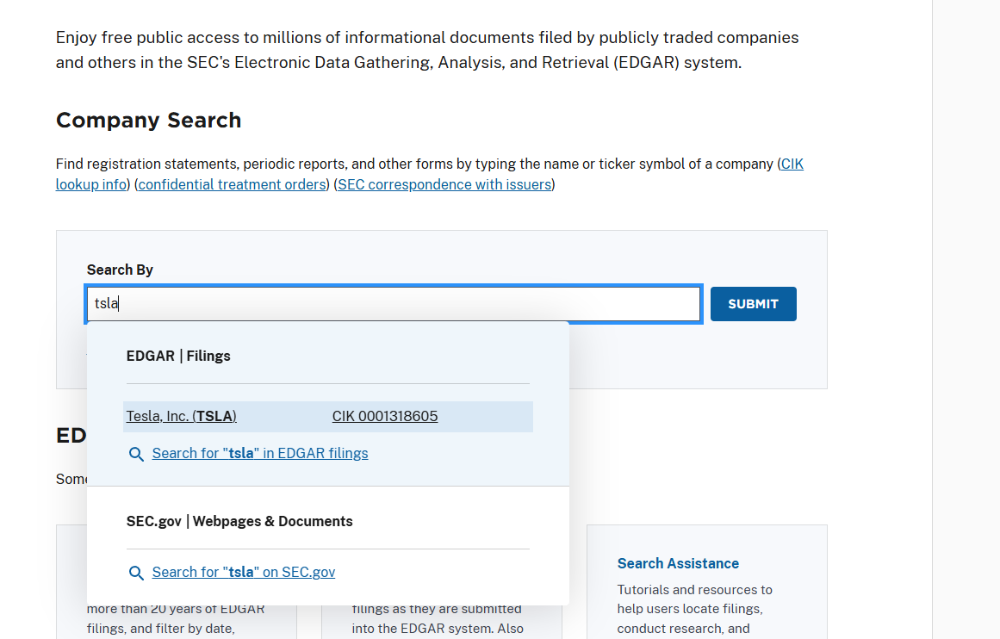
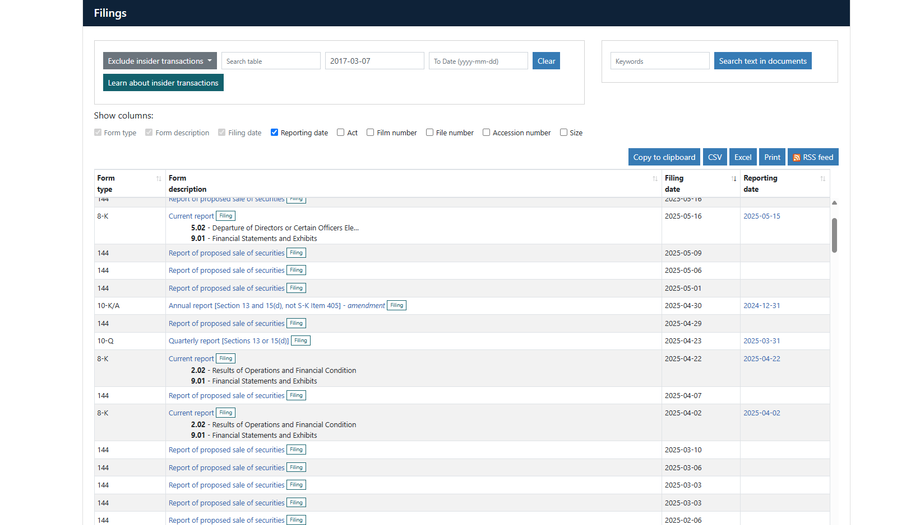
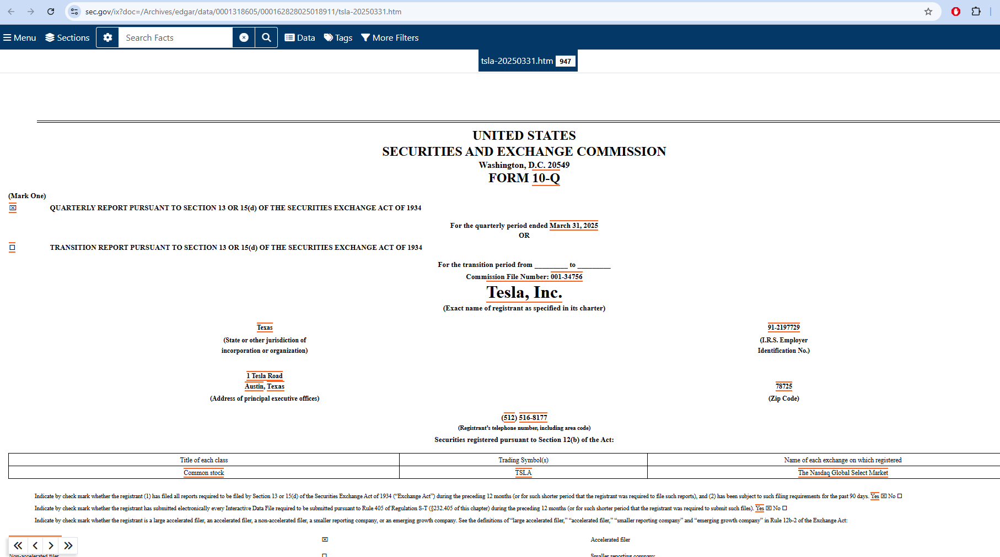
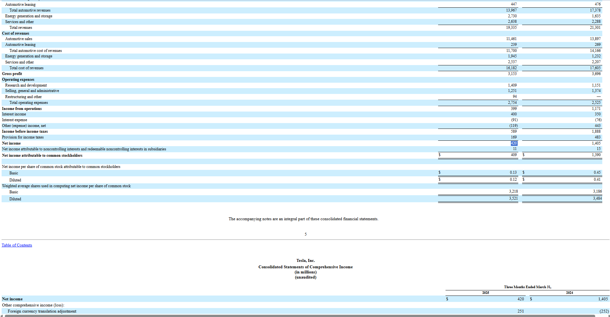
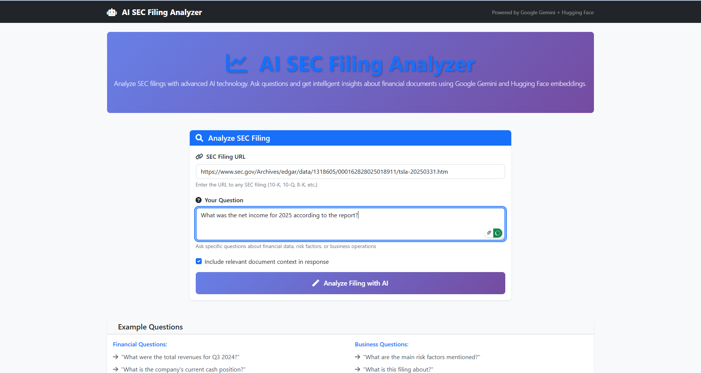
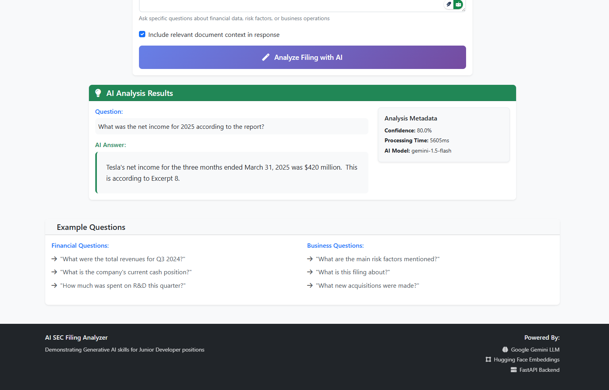

# AI SEC Filing Analyzer

A full-stack web application that demonstrates **Generative AI capabilities** for analyzing SEC filings using natural language queries. Built to showcase skills for Junior Generative AI Developer positions with **enterprise-grade architecture** and **production-ready deployment**.

## 🚀 **Quick Demo**

**Try it in 2 minutes:**
```bash
# 1. Set your Google AI API key (get free at https://aistudio.google.com/)
export GOOGLE_API_KEY="your-api-key-here"  # Linux/Mac
set GOOGLE_API_KEY=your-api-key-here       # Windows

# 2. Run the optimized demo
./demo.sh      # Linux/Mac
demo.bat       # Windows

# 3. Open http://localhost and paste any SEC filing URL!
```

**Need SEC filing URLs?** → https://www.sec.gov/search-filings (search for Apple, Tesla, Microsoft, etc.)

## 🎯 **What It Does**

Transform hours of manual SEC filing analysis into **seconds of AI-powered insights**:

- **Input**: SEC filing URL + natural language question
- **Output**: Accurate, sourced analysis with confidence scores
- **Example**: *"What were Tesla's Q1 2025 revenues?"* → *"$12,925 million in automotive sales, down from $16,460 million in Q1 2024"*

### **Real-World Value**
- **90% Time Reduction**: Analysis that took hours now takes minutes
- **Enhanced Accuracy**: AI reduces human oversight in complex financial data
- **Natural Interface**: Plain English questions instead of complex search queries
- **Source Attribution**: Every answer links to specific document sections

## 🛠 **Tech Stack & Architecture**

### **AI/ML Components**
- **Google Gemini API**: Advanced text analysis and question answering
- **Hugging Face Transformers**: Open-source embeddings (`sentence-transformers/all-MiniLM-L6-v2`)
- **ChromaDB**: Vector database for semantic search (no SQL database needed)
- **LangChain**: RAG pipeline framework for document processing

### **Backend & Frontend**
- **FastAPI**: High-performance Python API with automatic documentation
- **Vanilla JavaScript**: Pure frontend with Bootstrap UI
- **Pydantic**: Data validation and serialization
- **Uvicorn**: ASGI server for production deployment

### **RAG Pipeline Architecture**
```
User Input → Document Processing → Text Chunking → Embeddings → Vector Storage
     ↓
Question → Query Embedding → Similarity Search → Context Retrieval → AI Analysis → Response
```

## 📋 **Setup Options**

Choose your preferred setup method:

| Method | Use Case | Setup Time | Resource Usage |
|--------|----------|------------|----------------|
| **🐳 Docker Demo** | Interviews, Quick Testing | 2 minutes | 2GB RAM |
| **🐳 Docker Dev** | Full Development | 5 minutes | 4GB RAM |
| **🐍 Virtual Environment** | Python Development | 10 minutes | 2GB RAM |

---

## 🐳 **Option 1: Docker Setup (Recommended)**

### **🚀 Quick Demo (Interview Ready)**

**Prerequisites:**
- Docker Desktop running
- Google AI Studio API key (free at https://aistudio.google.com/)

**Setup:**
```bash
# 1. Clone repository
git clone <your-repo-url>
cd ai-sec-filing-analyzer

# 2. Set API key (choose your OS)
export GOOGLE_API_KEY="your-api-key-here"  # Linux/Mac
set GOOGLE_API_KEY=your-api-key-here       # Windows

# 3. Run optimized demo
./demo.sh      # Linux/Mac
demo.bat       # Windows
```

**Access Points:**
- **Frontend**: http://localhost
- **Backend API**: http://localhost:8000
- **API Documentation**: http://localhost:8000/docs

**Demo Features:**
- ✅ **68% smaller images** (optimized multi-stage builds)
- ✅ **Resource limited** (2GB RAM, 1 CPU core)
- ✅ **Ephemeral storage** (no data accumulation)
- ✅ **Fast startup** (~30 seconds)

### **🛠️ Full Development Environment**

For active development with hot-reload:

```bash
# Development with hot-reload and debugging
docker-compose up --build

# Access points:
# Frontend: http://localhost:3000
# Backend: http://localhost:8000
# Logs: docker-compose logs -f
```

### **🏭 Production Environment**

Production-ready with SSL, security headers, and optimization:

```bash
# Production setup with nginx reverse proxy
docker-compose -f docker-compose.prod.yml up --build -d

# Access: http://localhost (nginx handles routing)
```

### **Docker Environment Comparison**

| Environment | File | Purpose | Features |
|-------------|------|---------|----------|
| **Demo** | `docker-compose.demo.yml` | Interview/Testing | • Fast startup<br>• Resource limited<br>• Ephemeral storage |
| **Development** | `docker-compose.yml` | Active coding | • Hot-reload<br>• Debug tools<br>• Persistent data |
| **Production** | `docker-compose.prod.yml` | Deployment | • SSL/HTTPS<br>• Security headers<br>• Rate limiting |

---

## 🐍 **Option 2: Virtual Environment Setup**

For Python developers who prefer traditional virtual environment setup:

### **Prerequisites**
- Python 3.9+ installed
- Git installed
- Google AI Studio API key

### **Backend Setup**
```bash
# 1. Clone and navigate
git clone <your-repo-url>
cd ai-sec-filing-analyzer

# 2. Create and activate virtual environment
python -m venv venv

# Activate (choose your OS):
source venv/bin/activate        # Linux/Mac
venv\Scripts\activate          # Windows

# 3. Install dependencies
cd backend
pip install -r requirements.txt

# 4. Set up environment variables
cp env.example .env
# Edit .env file and add your GOOGLE_API_KEY

# 5. Run the backend server
uvicorn main:app --reload --host 0.0.0.0 --port 8000
```

### **Frontend Setup**
```bash
# Open new terminal
cd frontend

# Serve with any HTTP server:
python -m http.server 3000
# OR
npx serve . -p 3000
# OR
php -S localhost:3000  # If you have PHP
```

### **Virtual Environment Access Points**
- **Frontend**: http://localhost:3000
- **Backend API**: http://localhost:8000
- **API Documentation**: http://localhost:8000/docs

### **Development Workflow**
```bash
# Backend (in backend/ directory)
uvicorn main:app --reload --host 0.0.0.0 --port 8000

# Frontend (in frontend/ directory)  
python -m http.server 3000

# First run initialization:
# - ChromaDB creates database files automatically
# - Hugging Face downloads embedding model (~90MB)
# - Subsequent runs are faster with cached models
```

---

## 📖 **How to Use the Application**

### **Step 1: Find a SEC Filing**
1. Visit **SEC EDGAR**: https://www.sec.gov/search-filings
2. Search for any public company (Apple, Tesla, Microsoft, etc.)
3. Filter by filing type:
   - **10-K**: Annual comprehensive reports
   - **10-Q**: Quarterly financial reports  
   - **8-K**: Current event reports
4. Copy the filing URL from your browser

### **Step 2: Analyze with AI**
1. Open the application (http://localhost or http://localhost:3000)
2. Paste the SEC filing URL
3. Ask your question in plain English:
   - *"What were the total revenues for Q3 2024?"*
   - *"What are the main risk factors?"*
   - *"How much cash does the company have?"*
   - *"What is the company's outlook for next year?"*
4. Get intelligent analysis in ~30 seconds!

### **Step 3: Explore Results**
- **AI Analysis**: Detailed, contextual answers
- **Confidence Score**: AI confidence level (0.0-1.0)
- **Source Attribution**: Exact document sections referenced
- **Filing Metadata**: Company name, filing type, processing stats

### **💡 Complete Workflow Example**

Here is a complete walkthrough from finding a filing on SEC.gov to getting an AI-powered analysis:

**Step 1: Search for a company on the SEC EDGAR database.**
*Navigate to https://www.sec.gov/search-filings and search for a public company.*


**Step 2: Find a recent 10-K or 10-Q filing.**
*From the search results, locate the filing documents for the company.*


**Step 3: Open the filing document.**
*Click on the filing to open it. Look for the HTML document link.*


**Step 4: Copy the URL of the filing.**
*Once the filing is open in your browser, copy the full URL from the address bar.*


**Step 5: Paste the URL and ask your question.**
*Paste the URL into the application, type your question in plain English, and click "Analyze".*


**Step 6: Get an instant AI-powered response.**
*The system will process the document and provide a detailed, contextual answer to your question.*


---

## 🌐 **API Documentation**

### **Core Endpoints**
```bash
POST   /api/v1/analyses           # Create new SEC filing analysis
GET    /api/v1/analyses/{id}      # Get specific analysis
GET    /api/v1/system/status      # System health check
GET    /api/v1/examples/queries   # Example questions
```

### **Example API Usage**
```bash
# Health check
curl http://localhost:8000/health

# Analyze a filing
curl -X POST http://localhost:8000/api/v1/analyses \
  -H "Content-Type: application/json" \
  -d '{
    "filing_url": "https://www.sec.gov/ix?doc=/Archives/edgar/data/0001318605/000162828025018911/tsla-20250331.htm",
    "question": "What were the key financial metrics for Q1 2025?"
  }'
```

**Interactive API Documentation**: http://localhost:8000/docs (automatic FastAPI/Swagger docs)

---

## ⚙️ **Environment Variables**

### **Required Variables**
```bash
GOOGLE_API_KEY=your-google-ai-key-here    # Get free at https://aistudio.google.com/
```

### **Optional Configuration**
```bash
# Environment settings
ENVIRONMENT=production                     # development/production
DEBUG=false                               # Enable debug logging

# AI/ML settings
GEMINI_MODEL=gemini-2.5-flash            # Google Gemini model
HF_MODEL_NAME=sentence-transformers/all-MiniLM-L6-v2  # Hugging Face model
CHUNK_SIZE=1000                          # Document chunk size
CHUNK_OVERLAP=200                        # Chunk overlap for context
MAX_CHUNKS=100                           # Maximum chunks per document

# Performance settings
REQUEST_TIMEOUT=180                      # API timeout (seconds)
VECTOR_DB_PATH=/app/chroma_db           # ChromaDB storage path

# CORS settings (for production)
ALLOWED_ORIGINS=https://your-domain.com  # Comma-separated origins
```

---

## 🚀 **Deployment Options**

### **Local Testing**
```bash
# Quick demo
./demo.sh

# Development
docker-compose up

# Production test
deploy.bat prod
```

### **Cloud Deployment**

**Option 1: GitHub Actions (Automated)**
- Push to GitHub → Automatically deploys to Azure
- Uses `deploy/github-actions/deploy.yml`
- Requires Azure credentials in GitHub secrets

**Option 2: Manual Azure Deployment**
```bash
# Azure Container Instances
az container create --file deploy/azure/container-instances.yml

# Azure App Service
az webapp create --file deploy/azure/app-service.yml
```

**Option 3: Other Cloud Providers**
- The Docker images work on any cloud platform
- AWS ECS, Google Cloud Run, DigitalOcean, etc.

---

## 📚 **Skills Demonstrated**

This project showcases key skills for **Generative AI Developer** roles:

### **AI/ML Skills**
- ✅ **LLM Integration**: Google Gemini for complex text analysis
- ✅ **Embeddings**: Hugging Face transformers for semantic search
- ✅ **Vector Databases**: ChromaDB for similarity search
- ✅ **RAG Pipeline**: Complete Retrieval-Augmented Generation implementation
- ✅ **Prompt Engineering**: Optimized prompts for financial analysis

### **Software Development**
- ✅ **Python Proficiency**: Clean, well-structured FastAPI backend
- ✅ **API Design**: RESTful services with automatic documentation
- ✅ **Frontend Development**: Responsive JavaScript application
- ✅ **SOLID Principles**: Modular, maintainable code architecture
- ✅ **Error Handling**: Robust error handling and logging

### **DevOps & Production**
- ✅ **Docker Optimization**: Multi-stage builds, 68% size reduction
- ✅ **Multiple Environments**: Development, demo, production configurations
- ✅ **Cloud Deployment**: Azure Container Instances and App Service ready
- ✅ **CI/CD Pipeline**: GitHub Actions for automated deployment
- ✅ **Security**: Production-grade security headers and practices

---

## 🗂️ **Project Structure**

```
ai-sec-filing-analyzer/
├── 📁 backend/                    # FastAPI application
│   ├── app/
│   │   ├── api/routes/           # API endpoints
│   │   ├── core/                 # Configuration
│   │   ├── models/               # Pydantic schemas
│   │   ├── services/             # Business logic
│   │   └── utils/                # Utilities
│   ├── main.py                   # Application entry point
│   └── requirements.txt          # Python dependencies
├── 📁 frontend/                   # Vanilla JavaScript UI
│   ├── assets/                   # CSS, JS files
│   ├── components/               # UI components
│   └── index.html                # Main page
├── 📁 deploy/                     # Deployment configurations
│   ├── azure/                    # Azure deployment files
│   └── github-actions/           # CI/CD workflows
├── 📁 docs/                       # Additional documentation
│   ├── PROBLEM_STATEMENT.md      # Business context
│   ├── BUSINESS_OVERVIEW.md      # Value proposition
│   └── TECHNICAL_DEEP_DIVE.md    # Architecture details
├── 🐳 docker-compose.yml          # Development environment
├── 🐳 docker-compose.demo.yml     # Interview/demo environment
├── 🐳 docker-compose.prod.yml     # Production environment
├── 🐳 Dockerfile                  # Production image
├── 🐳 Dockerfile.dev              # Development image
├── 🌐 nginx.*.conf                # Nginx configurations
├── 📜 demo.sh / demo.bat          # Quick demo scripts
├── 📜 deploy.sh / deploy.bat      # Deployment scripts
└── 📖 README.md                   # This file
```

---

## 🔧 **Troubleshooting**

### **Common Issues**

**Port conflicts:**
```bash
# Check what's using ports 8000 or 3000
netstat -tulpn | grep :8000  # Linux
netstat -ano | findstr :8000  # Windows
```

**API key issues:**
```bash
# Verify API key is set
echo $GOOGLE_API_KEY        # Linux/Mac
echo %GOOGLE_API_KEY%       # Windows
```

**Docker memory issues:**
```bash
# Increase Docker memory limit in Docker Desktop settings
# Or use demo config with lower resource requirements
./demo.sh
```

**First run is slow:**
- Hugging Face downloads ~90MB embedding model
- ChromaDB initializes database files
- Subsequent runs are much faster

### **Debug Commands**
```bash
# Check container status
docker-compose ps

# View logs
docker-compose logs -f

# Access container shell
docker-compose exec sec-analyzer bash

# Clean up
docker system prune -af --volumes
```

---

## 📋 **Additional Documentation**

For deeper understanding:

- **[Problem Statement](docs/PROBLEM_STATEMENT.md)**: Business context and challenges
- **[Business Overview](docs/BUSINESS_OVERVIEW.md)**: Value proposition and use cases  
- **[Technical Deep Dive](docs/TECHNICAL_DEEP_DIVE.md)**: Architecture and implementation details
- **[Docker Optimization Guide](DOCKER_OPTIMIZATION.md)**: Performance optimization details

---

## 🎯 **Why Vector-First Architecture?**

This application demonstrates modern **AI-first architecture** principles:

- **No SQL Complexity**: ChromaDB eliminates database schemas and migrations
- **AI-Native Storage**: Purpose-built for machine learning workloads
- **Faster Development**: Focus on AI functionality, not database design
- **Better Performance**: Vector similarity search outperforms SQL joins for this use case
- **Simpler Deployment**: One less system to configure and maintain

---

## 📄 **License**

This project is available under the MIT License. See [LICENSE](LICENSE) for details.

---

## 📧 **Contact**

**Email**: martin.kitukov@gmail.com  
**LinkedIn**: https://www.linkedin.com/in/martin-kitukov-b205381b0/

---

*This application demonstrates the core competencies required for Generative AI development roles, with architecture designed for scalability and maintainability in enterprise environments.*